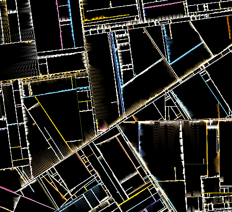

# Substrate

> [!CAUTION]
> Still a fun JavaScript environment to work on the old classics, but I don't want to keep maintaining it. Thus, it has been **archived as of 2026-03-22**.

Requires calibration on first run. Patience, please.

Click canvas to pause. Click background to fullscreen.

a canvas experiment by Oliver Salzburg  
inspired by original Substrate artwork by Jared Tarbell
